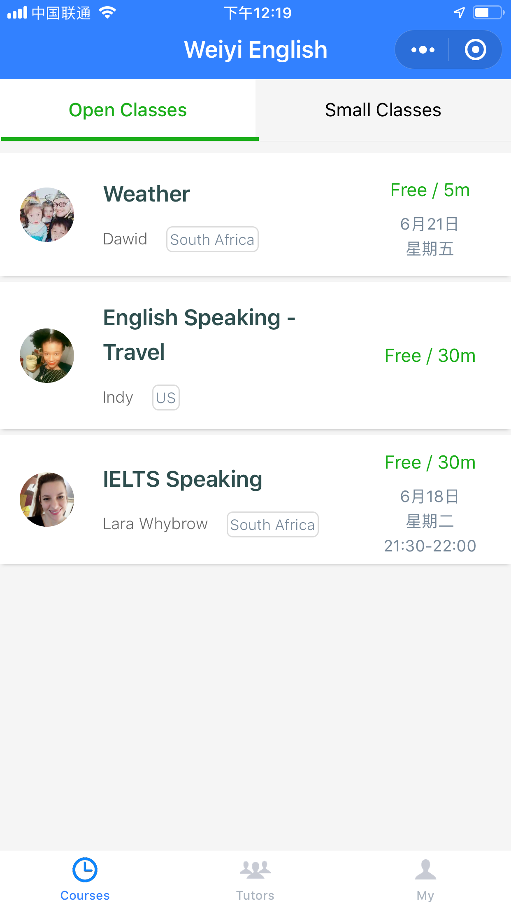

# Teach English on WeChat

We are developing a platform for English teachers and Chinese students to find and communicate conveniently. It is based WeChat - the biggest social media in China.

## Overview

[Open English Classes](http://openenglishclasses.com) - (Under development)

微移英语 - A WeChat official account.

  

**Weiyi English** - A mini program (a type of mini applications running on WeChat), under development

  
  

