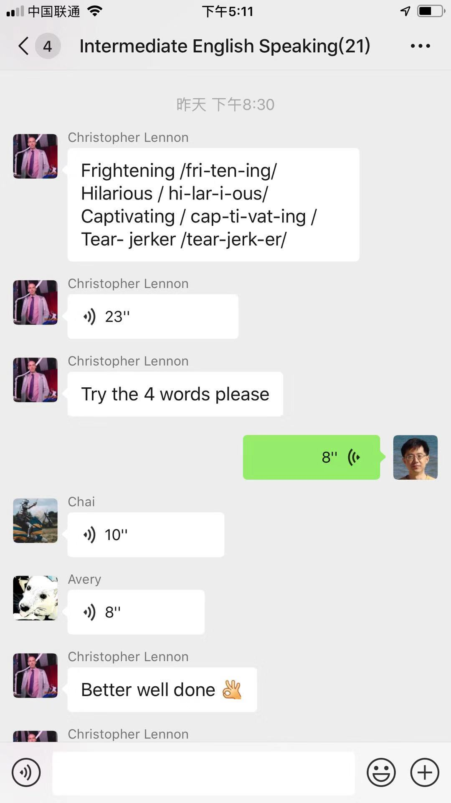
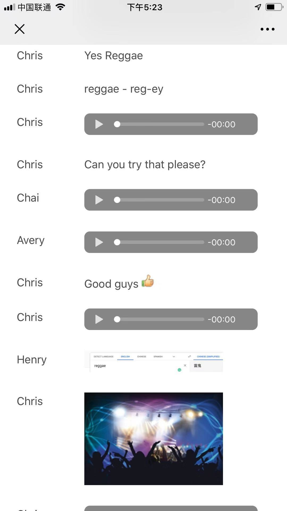
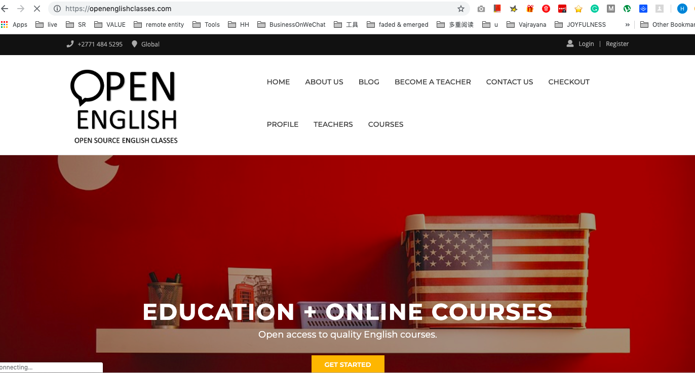

# 微移英语

微移英语是一个学生与英语教师交流沟通、选课购买的平台。它要解决的问题是，

    中国人如何才能找到优秀的、适合自己的、收费合理的英语老师？

它提供的解决办法是，

    借助微信平台，让中国学生方便的直接接触了解优秀英语老师与课程，让来自全世界的英语老师直接与学生交流，了解学生需求。

需要说明的是，微移英语不是一个教学平台（至少在第一阶段不做在线课堂功能），英语授课通过其他方式完成，如微信、Skype、Zoom等。

用淘宝做类比，淘宝让商户（英语教师）在平台上展示商品（老师自我介绍，课程介绍），用户选择并购买商品（课程），商户寄送商品（实际授课）。

## 用户角色与基本业务模式

用户

- 外籍英语教师（以英语为母语的教师为主）
- 学生

基本业务模式

1. 外教展示个人信息、课程信息在小程序上。
2. 学生在小程序上可以浏览课程信息，试听录制好的体验课。
3. 学生在小程序上注册上课（免费），或是购买课程。
4. 老师授课（在微信群，或是其他的平台）

营销方式

不定期在微信群组织活动，包括话题讨论、公开课等。

主要收入实现方式

- 课程销售提成
- 销售原创的微信群小班课
- 其他: 广告，学生会员费，服务费（翻译，展示位置等）

例子一：小李大学毕业两年，想业余时间提高英语，工作中需要，为留学做准备。有一定的英语基础，但是目前长时间不学习使用，逐渐生疏了。于是，她尝试“微移英语”，浏览老师与课程，选中英国老师 Natalie 的口语听力提高班，每周两次课程，由于有时加班，上课时间来不了，可以在第二天复习上课内容，老师教的内容，有疑问随时发到群里，老师解答。提交作业。上课时，有live chat，有效提升口语和听力。

例子二：在校生小王，准备留学，雅思听说太差，想找老师突击一下，但是培训机构的费用太高，没有适合自己的。她到“微移英语”，接触了几个外教，试听他们课程，请老师给出学习建议，最终选择了一个美国老师，辅导托福考试。

### 为什么市场上需要一个新的竞争者

要解决的根本问题是，在手机上进行语言学习。

1. 从公众号的成功可以看出，用户不在意文章的长度。在手机上滑动屏幕是很自然的一件事情，只要内容足够吸引人，用户可以一直滑动。

引申出来：当前的视频、音频应该自动播放（no，有些场合不适合外播声音）

2. 课程由文本、图片、音频、视频组成，是最灵活的方式。包括对话，表情包等。

引申：给教师提供方便的课程制作工具。

3. 交流的重要性。让用户在任意片段中，可以进行提问、讨论，对课程是很好的扩充！

4. 测评系统建立（for students）

5. 学习情况跟踪，图表、笔记！

### 怎么实现？

大致路线图

- 微移英语小程序 - 实现课程及课程表展示、老师信息展示、课程注册、课程购买。
- 微信群 - 小班微信群课
- 微移英语公众号
- 网站(https://openenglishclasses.com/) - 主要面向外教，老师可以进行课程发布、消息回复。

### 目前的进展

微信群：大群 2 个，人数 300+。上课的小群4个

微信公众号两个

微博：粉丝800+

老师：5个

课程：

- 雅思口语 (Lara)
- 中级英语 (Chris)
- 初级英语 (Natalie)
- 英语发音 (Indy)

微信群上课截图

  

{ width="100px", height="233px" }

把微信消息导出制作成课程，可以在网站及小程序上展示

  

小程序实现课程管理：

  
  
  

网站还在开发中，需要与小程序和公众号进行整合。

  

## 团队成员

- Henry         [中国] 创始人，高级工程师。清华大学硕士，曾在中国银行从业多年。
- Lara Whybrow  [南非] 资深英语教师，设计师，企业家
- India Lewis   [美国] 资深英语教师，博士
- Christopher   [英国] 资深英语教师
- Alex          [中国] 高级工程师
- 吴静          [中国] 律师，北京市京师律师事务所合伙人

## 英语培训市场

### 中国的英语培训市场现状

### 竞争者比较 (从英语学习者角度看）

#### 培训机构辅导班

优势：
面对面辅导，可信度高，效果好

劣势：费用高，好老师不容易

#### 在线真人培训：

优势：时间方便

劣势：费用高，老师质量良莠不齐

#### 在线录播课程：

优势：价格低，随时可用

劣势：缺少交互

#### 微移英语

优势：
1. 可获取
2. 价格低

劣势：项目起步阶段，品牌创建需要一个过程

## 项目及融资计划（12个月）

### 项目计划 

#### 2019.07-09

- 基础设基本可用：
    - 学生在小程序上注册、购买、管理课程
    - 老师在小程序和网站上申请注册、发布课程、编辑课程内容。
- 老师人数 > 30
- 微信群课 > 5
- 公众号粉丝
- 月销售收入

#### 2019.10-12

- App 开始开发(iOS)
- 老师人数 > 60
- 微信群课 > 10
- 公众号粉丝
- 月销售收入

#### 2020.01-03

- 发布QQ小程序，开始上QQ群课
- 老师人数 > 120
- 微信/QQ群课 > 30
- 公众号粉丝
- 月销售收入

#### 2020.04-06

- 老师人数 > 240
- 微信/QQ群课 > 50
- 公众号粉丝
- 月销售收入

### 融资计划

首次融资：**50万人民币，占股10%**

#### 融资用途

- 开发及设计人员工资（3人）： 30万
- 教师及课程开发费用：        10万
- 课程助理（1-2人）：         6万
- 杂费：                      4万

预计2019年底将实现收支平衡。目前还很难预测一年内的收入增长情况，因为主要的影响因素是用户增长速度，目前还难以预测系统推出后，用户增长情况。

